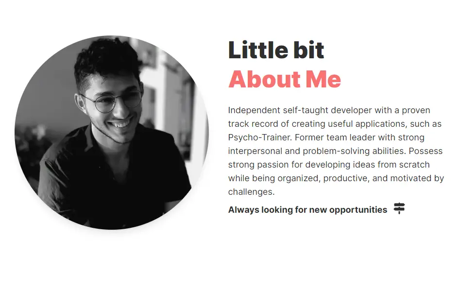

# My Portfolio Website
I have created a portfolio website that displays my learning journey and the various projects I have completed. I will continue to add new content, so be sure to visit the site and check for updates.

I created this project using some of the knowledge I gained in:
- HTML, CSS ,JavaScript
- Typescript
- React & NextJS
- TailwindCSS
- Graphic Design
- Git

.
.
.

I hope you enjoyed reading about this project, thank you for your time 😁

Live site: https://gateniomer.github.io/portfolio/

Github repo: https://github.com/gateniomer/portfolio

